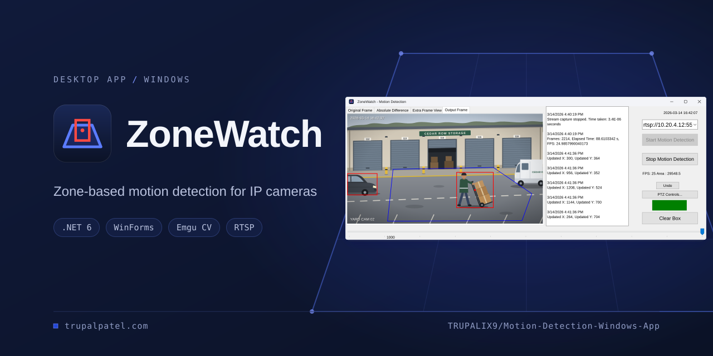
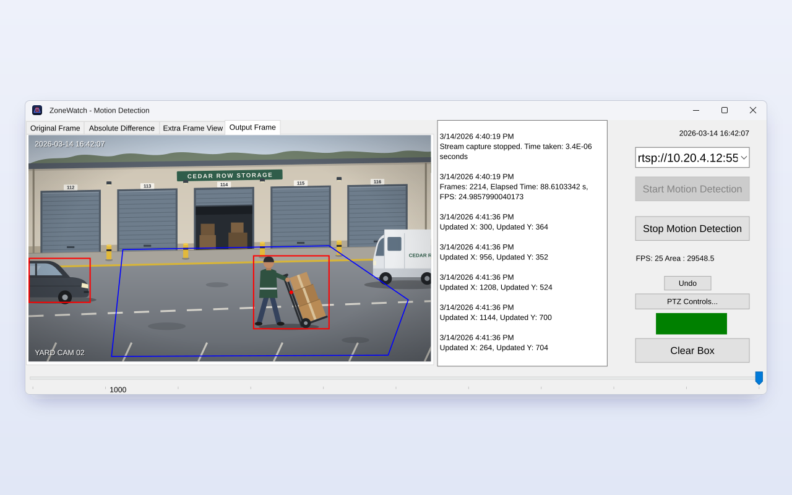
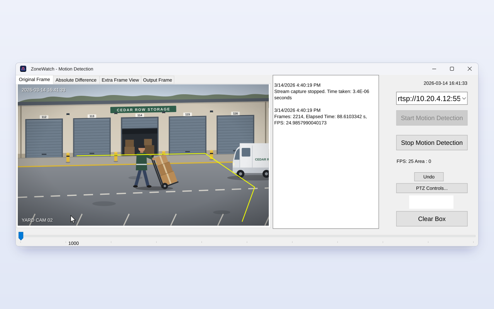
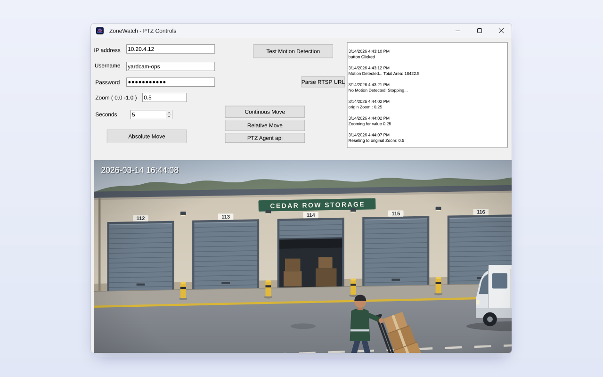
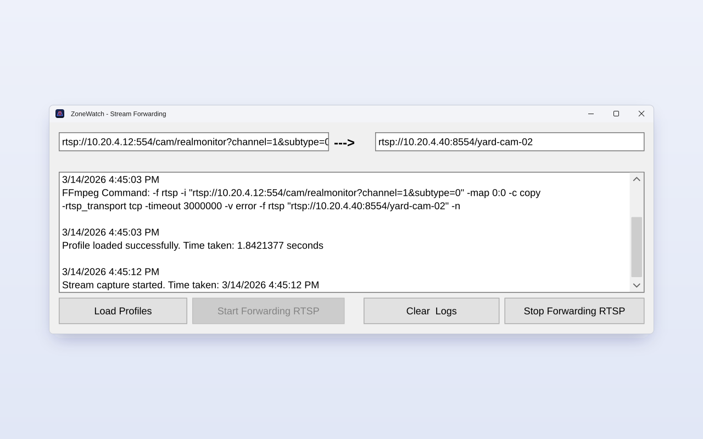
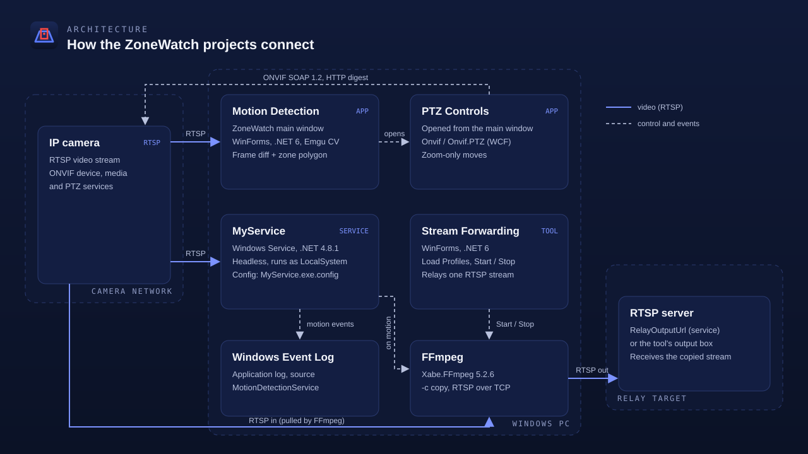

<p align="center">
  
</p>

<p align="center"><strong>A Windows desktop app that watches an RTSP camera and flags motion only when it happens inside a zone you draw on the video.</strong></p>

<p align="center">
  <a href="https://trupalpatel.com/projects/motion-detection"></a>
  
  
  
  
  
</p>

<p align="center">
  <a href="https://trupalpatel.com/projects/motion-detection"><strong>Case study</strong></a> ·
  <a href="https://trupalpatel.com"><strong>Portfolio</strong></a>
</p>

---

## Overview

Plain motion detection on an IP camera fires on everything in the frame: a passing car, a tree, the road outside the gate. ZoneWatch reads the camera's RTSP stream, finds moving objects by frame differencing with OpenCV (through Emgu CV), and counts an object only when its centre falls inside a polygon you draw on the video.

It was written in C# in late 2023. The Visual Studio solution holds three programs: the ZoneWatch WinForms app with an ONVIF PTZ window, a headless Windows service that runs the same detection and writes to the Event Log, and a small FFmpeg tool that relays one RTSP stream to another.

## Features

- **Zone-based motion detection**: grayscale, 9x9 Gaussian blur, absolute difference with the previous frame, threshold 30, dilate twice, then external contours of at least 10,000 px². A contour counts as motion only when the centre of its bounding box is inside the zone polygon.
- **Draw your own zone**: click points on the Original Frame tab, double-click to close the polygon, and Undo to remove the last point. Each point is logged in source-frame pixels.
- **Four live views**: Original Frame, Absolute Difference, Extra Frame View (the blurred grayscale frame) and Output Frame (red contour boxes, the blue zone and a red centroid dot).
- **Debounced motion indicator**: turns green after 3 consecutive frames with motion in the zone and red once 3 still frames follow a 10 second hold. It sits beside an FPS and contour-area readout and an area trackbar.
- **PTZ Controls window (ONVIF)**: opened with the main window's **PTZ Controls...** button. Zoom-only continuous, absolute (hold for 5-120 seconds, then return) and relative moves, PtzAgent zoom in/out, an RTSP URL parser and a quick motion test.
- **Headless Windows service**: runs detection on one configured camera, writes "Motion Detected" / "No Motion Detected!" to the Application Event Log (source `MotionDetectionService`), and can relay the stream to an RTSP server with FFmpeg while motion lasts.
- **Stream Forwarding tool**: relays one RTSP stream to another with `ffmpeg -c copy` over TCP, showing the FFmpeg command it built.

### Known limitations

- Frame differencing reacts to lighting changes, shadows and camera shake. The thresholds (30, 10,000 px², 3 frames, 10 s) are constants in the code.
- One camera per window. The zone is kept in memory only and resets to a built-in default on the next launch.
- The service does not use a zone: its polygon check is commented out, so any contour of at least 10,000 px² counts.
- PTZ is zoom-only (no pan or tilt). PTZ commands go to `/onvif/device_service` on the host and port you enter.
- The apps target .NET 6, which is out of support. Newer SDKs still build it but warn (NETSDK1138).

## Screenshots

<table>
  <tr>
    <td align="center" width="50%">
      
      <br /><sub><b>Motion detection</b>: a worker inside the zone is flagged; the car outside it is boxed but ignored</sub>
    </td>
    <td align="center" width="50%">
      
      <br /><sub><b>Drawing a zone</b>: click points on the Original Frame, double-click to close</sub>
    </td>
  </tr>
  <tr>
    <td align="center" width="50%">
      
      <br /><sub><b>PTZ Controls</b>: ONVIF zoom moves and a motion test, opened from the main window</sub>
    </td>
    <td align="center" width="50%">
      
      <br /><sub><b>Stream Forwarding</b>: RTSP-to-RTSP relay with the FFmpeg command it built</sub>
    </td>
  </tr>
</table>

<sub>Screens are recreated from the app's real UI in SVG, filled with fictional demo data.</sub>

## Architecture

<p align="center">
  
</p>

The camera's RTSP stream goes to the ZoneWatch app, which decodes frames with Emgu CV, draws the result and drives the indicator. The same app's PTZ window talks to the camera over ONVIF (SOAP 1.2 with HTTP digest auth). MyService reads the stream without a UI, logs motion to the Event Log and starts an FFmpeg relay to an RTSP server while motion lasts. The Stream Forwarding tool runs the same relay by hand.

## Tech stack

| Layer | Technology |
|---|---|
| App | C#, WinForms on .NET 6 (`net6.0-windows`): main window, PTZ window, Stream Forwarding tool |
| Service | .NET Framework 4.8.1 Windows Service (`ServiceBase`, InstallUtil `ProjectInstaller`) |
| Vision | Emgu.CV 4.8.1 (OpenCV for .NET), Emgu.CV.Bitmap, Emgu.CV.runtime.windows |
| Camera control | Onvif 1.0.14, Onvif.Media 1.0.10, Onvif.PTZ 1.0.10 (WCF, SOAP 1.2, HTTP digest) |
| Streaming | Xabe.FFmpeg 5.2.6, Xabe.FFmpeg.Downloader 5.2.6 |
| Tooling | Visual Studio 2022 solution (`Motion Detection Windows App.sln`) |

## Getting started

### Prerequisites

- Windows 10 or 11, x64 (Emgu.CV.runtime.windows, WinForms and the service are Windows-only)
- Visual Studio 2022 with the **.NET desktop development** workload
- .NET 6 SDK for the two WinForms projects
- .NET Framework 4.8.1 Developer Pack (targeting pack) for `MyService`. The solution makes **Motion Detection** depend on MyService, so a full solution build needs it.
- An IP camera with an RTSP stream (ONVIF with PTZ for the PTZ window)
- For the Stream Forwarding tool: `ffmpeg.exe` and `ffprobe.exe` on `PATH`. The service downloads FFmpeg on start unless you point it at a local copy.

### Install

```bash
git clone https://github.com/TRUPALIX9/Motion-Detection-Windows-App.git
cd Motion-Detection-Windows-App
```

Open `Motion Detection Windows App.sln` in Visual Studio 2022. NuGet packages restore on the first build. To build from a Developer Command Prompt instead:

```bash
dotnet build "Motion Detection/Motion Detection.csproj"
dotnet build "FFMPEG-Stream-Forwarding/FFMPEG-Stream-Forwarding.csproj"
msbuild MyService/MyService.csproj -restore -p:Configuration=Release
```

### Environment variables

Nothing camera-specific is hard-coded. Every value is optional for the desktop apps, which let you type it in. The names are listed in [`.env.example`](.env.example). The apps read them from the process environment and do not load that file. For example, in PowerShell:

```powershell
$env:ZONEWATCH_RTSP_URL = "rtsp://<user>:<password>@<camera-ip>:554/<path>"
dotnet run --project "Motion Detection/Motion Detection.csproj"
```

| Variable | Required | Description |
|---|---|---|
| `ZONEWATCH_RTSP_URL` | Service and PTZ motion test | Camera stream. Pre-fills the main window's URL box and the forwarding tool's input. The PTZ window's **Test Motion Detection** button has no URL box and reads only this variable |
| `ZONEWATCH_RELAY_URL` | No | RTSP target: the forwarding tool's output box, and the service's relay while motion lasts |
| `ZONEWATCH_PTZ_HOST` | No | Pre-fills the PTZ window's IP address box (`host` or `host:port`, default port 80) |
| `ZONEWATCH_PTZ_USERNAME` | No | Pre-fills the PTZ window's username |
| `ZONEWATCH_PTZ_PASSWORD` | No | Pre-fills the PTZ window's (masked) password |
| `ZONEWATCH_FFMPEG_DIR` | No | Service only: folder containing `ffmpeg.exe` and `ffprobe.exe`; skips the FFmpeg download |

The service also reads `RtspInputUrl`, `RelayOutputUrl` and `FFmpegDirectory` from `appSettings` in `MyService.exe.config`, next to the built `MyService.exe`. An environment variable overrides each key. Keep real camera URLs and passwords out of source control.

### Run

**ZoneWatch app** (set **Motion Detection** as the startup project, or `dotnet run --project "Motion Detection/Motion Detection.csproj"`):

1. Type the camera's RTSP URL into the box at the top right (or set `ZONEWATCH_RTSP_URL`) and press **Start Motion Detection**. The indicator turns white.
2. On **Original Frame**, click to place zone points, double-click to close the zone, and use **Undo** to drop the last point.
3. Watch **Output Frame**. The indicator turns green for motion in the zone and red after it stops for 10 seconds. **Clear Box** clears the log.
4. **PTZ Controls...** opens the ONVIF window. Enter the camera host, username and password, a zoom value and a hold time, then pick a move.

**Stream Forwarding**: run `dotnet run --project "FFMPEG-Stream-Forwarding/FFMPEG-Stream-Forwarding.csproj"`, fill in the input and output RTSP URLs, click **Load Profiles**, then **Start Forwarding RTSP**.

**Windows service**: set `RtspInputUrl` (and optionally `RelayOutputUrl`) in `MyService\bin\Release\MyService.exe.config`, then from an elevated Developer Command Prompt:

```bash
installutil MyService\bin\Release\MyService.exe
sc start MyService
```

Events show in Event Viewer under **Windows Logs > Application**, source `MotionDetectionService`. To remove the service: `sc stop MyService`, then `installutil /u MyService\bin\Release\MyService.exe`.

There are no automated tests.

## Project structure

```text
Motion-Detection-Windows-App/
├── Motion Detection/                  # ZoneWatch WinForms app (.NET 6)
│   ├── Motion Detection Form.cs       # main window: capture, frame differencing, zone drawing
│   ├── Form1.cs                       # PTZ Controls window: ONVIF zoom moves, motion test
│   ├── ffmpeg.cs                      # Xabe.FFmpeg relay helper
│   └── Program.cs                     # starts the main window
├── MyService/                         # headless Windows service (.NET Framework 4.8.1)
│   ├── Service1.cs                    # detection loop, Event Log, relay on motion
│   ├── ProjectInstaller.cs            # InstallUtil installer (service name MyService)
│   └── App.config                     # RtspInputUrl, RelayOutputUrl, FFmpegDirectory
├── FFMPEG-Stream-Forwarding/          # RTSP-to-RTSP relay tool (.NET 6 WinForms)
├── docs/assets/                       # banner, logo, icon, screenshots, architecture
├── .env.example                       # environment variable names (no values)
└── Motion Detection Windows App.sln   # Visual Studio 2022 solution
```

## Author

**Trupal Patel**

<p>
  <a href="https://trupalpatel.com">Portfolio</a> ·
  <a href="mailto:trupal.work@gmail.com">trupal.work@gmail.com</a> ·
  <a href="https://www.linkedin.com/in/trupalix">LinkedIn</a> ·
  <a href="https://github.com/TRUPALIX9">GitHub</a>
</p>
